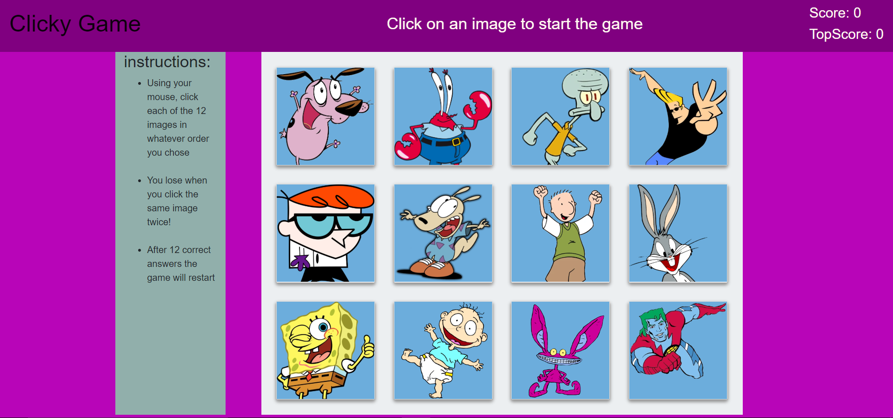

# Click Game

## Overview

This is a memory game built with React.js. Using the mouse, click each of the twelve images in whatever order you chose **the order does not matter**, only that you do not click the same card twice!

## Getting Started
These instructions will get you a copy of the project up and running on your local machine for development and testing purposes.

### Installing
Git clone the repository to your local machine:

HTTPS:
```
https://github.com/AmjedAyoub/Clicky-Game.git
```
SSH:
```
git@github.com:AmjedAyoub/Clicky-Game.git
```
Open the cloned repository in your visual studio.

You will then be able to start the app locally by running:

```
nom install
```

```
nom start
```

## Screenshots

### Start page


## Technologies & Tools
* React.js

## Links
This program is deployed on [GitHub Pages](https://amjedayoub.github.io/Clicky-Game/).\
This program is published on [GitHub](https://github.com/AmjedAyoub/Clicky-Game).

## Authors
See contribution history [here](https://github.com/AmjedAyoub/Clicky-Game/graphs/contributors).

